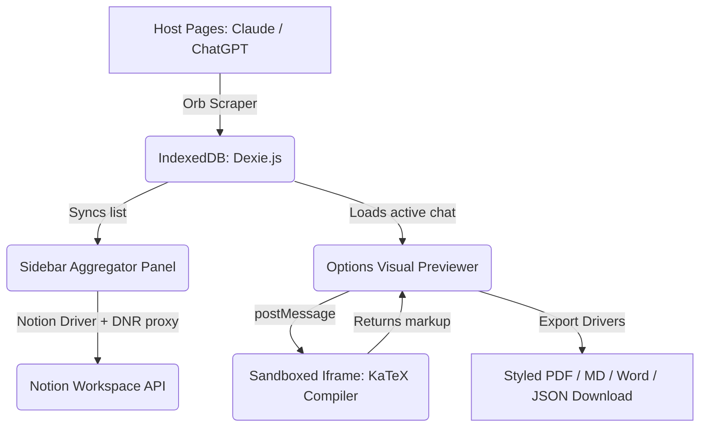

# Omniscribe AI: Production Walkthrough & User Manual

Welcome to **Omniscribe AI**, a unified, local-first context bridge, visual document compilation deck, and sandboxed math rendering extension. This document outlines the architecture, user flows, and instructions for testing and running the extension.

---

## 🚀 1. Quick Start Installation Guide

To load the compiled extension into Google Chrome:

1. **Clean Compile:** Build all pages by running the automated compiler command:
   ```bash
   npm run build
   ```
   This compilespopup, options, sidebar, and sandbox entries into the `dist/` directory and copies configuration schemas automatically.
2. **Open Extensions Manager:** Launch Google Chrome and navigate to:
   ```text
   chrome://extensions/
   ```
3. **Toggle Developer Mode:** Turn on the **Developer Mode** slider in the top-right corner.
4. **Load Unpacked:** Click the **Load unpacked** button in the top-left, navigate to the `e:\Projects\Extension V2\` workspace, and select the output `dist` folder.
5. **Pin Omniscribe:** Locate **Omniscribe AI** in your Chrome Extensions menu (puzzle icon) and pin it to your toolbar.

> [!NOTE]  
> A pre-packaged production zip `omniscribe-ai-extension.zip` has been generated in the root directory for immediate manual uploads.

---

## 🎨 2. Core User Flows & Functionality

### A. The Floating Orb & Scraper (In-Context Bridge)
*   **Target Websites:** Matches ChatGPT, Claude, Gemini, Perplexity, and Grok.
*   **Behavior:** When you visit any of these pages, a glassmorphic **Omniscribe Floating Orb** mounts in the bottom-right corner using a safe **Shadow DOM** to prevent website styling leaks.
*   **Manual Trigger:** Click **Capture Thread** on the Orb. The extension scrapes the active thread's prompts and answers, formats them, and writes them into local IndexedDB storage.
*   **Context Handoff:** Click any target (e.g., *Claude*) on the Orb's expansion menu. The extension stores the active conversation thread history, sets a pending bridge, opens the destination page, automatically inserts the history prefixed with your custom preamble, and submits the prompt.

### B. The Sidebar Aggregator (`sidepanel.html`)
*   **Access:** Click the Omniscribe extension icon or click **Open Sidebar Aggregator** in the popup menu.
*   **Search & Tag Filters:** Type search terms to filter conversation histories by title or platform. Click tag buttons (e.g. `#research`) to narrow down logs.
*   **Sync to Notion Workspace:**
    1. Select any conversation card.
    2. Input a target **Notion Parent Page or Database ID**.
    3. Click **Sync Now**.
    4. The syncer automatically splits large text streams into Notion-compliant paragraph blocks (< 2,000 characters) and constructs headers. Clicking the output link opens the synced page directly in Notion.

### C. Options Panel & Math Previewer (`options.html`)
*   **Access:** Right-click the extension icon and select **Options**.
*   **Real-Time Style Editor:** Slide settings for **Font Size**, **Page Margins**, and **Line Spacing**. Toggle between curated visual themes (*Cherry Sakura*, *Royal Lavender*, *Sleek Slate*, *Charcoal*, *Emerald*).
*   **Sandboxed LaTeX Math Compiler:**
    *   Inline formulas (`$x^2$`) and display formula blocks (`$$\int_{-\infty}^{\infty} e^{-x^2} dx = \sqrt{\pi}$$`) are captured dynamically.
    *   The formula is posted to a sandboxed iframe to bypass strict Manifest V3 Content Security Policies.
    *   The compiled SVG/HTML vector markup returns from the sandbox and updates the preview immediately.
*   **Export Drivers:** Downloader buttons compile and trigger local downloads of **PDF** (rendered dynamically using `jsPDF`), **Markdown**, **Word (`.doc`)**, or structured **JSON** schema files.

---

## 🏗️ 3. Under the Hood: Technical Architecture



### Key Technical Decisions:
*   **Zero-Cloud Footprint:** All user conversations, settings, and file rendering remain local to your browser profile.
*   **DNR Proxy Rules:** Outgoing Notion requests flow through Declarative Net Request rules to strip headers like `Origin` and `Referer`, preventing CORS blocking without needing a remote proxy backend.
*   **Memory-Safe PDF Wrapping:** jsPDF line calculation logic automatically paginates blocks, wraps long text nodes, and handles line heights dynamically to match theme specifications.
