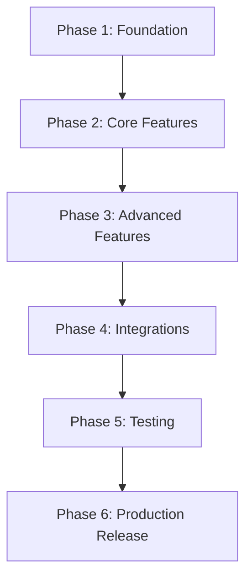

# Final Specification & Phase-by-Phase Implementation Plan
**Product:** Omniscribe AI (Consolidated Super-Extension)  
**Author:** Technical Lead & Senior Program Architect  
**Date:** June 14, 2026  
**Status:** Approved Roadmap for Code Scaffolding

---

## Part 1: Product Specification & Core Summaries

### 1. Final Product Summary
Omniscribe AI is a high-performance, local-first Chromium extension (Manifest V3) that merges context bridging and document archiving. It enables users to transfer ongoing conversation threads between active LLM interfaces (Claude, ChatGPT, Gemini, Perplexity, and Grok) with a single click. Additionally, it preserves historical sessions locally via IndexedDB, letting users customize themes (Sakura, Lavender, etc.) and compile equations to export print-ready PDFs, Markdown, Word documents, or directly sync them to Notion.

### 2. Final Feature List
*   **Draggable Glassmorphic Handoff Orb:** Injected floating widgets on target LLM pages offering instant transfer shortcuts.
*   **Context Bridging Engine:** Multi-LLM text scrapers, background tab-load event routers, and editor value inputs (Quill/ProseMirror).
*   **IndexedDB Local History Vault:** Dexie-managed database that caches conversations, titles, and text blocks completely offline.
*   **Split-Pane Options Styling Preview Page:** Theme customization control deck (font scale, layout margins) paired with a live visual print simulator.
*   **LaTeX Equation Sandbox Compiler:** Isolated iframe sandbox wrapper that parses math notations into vector graphics using KaTeX.
*   **SidePanel Multi-Chat Aggregator:** Chromium SidePanel manager allowing users to collect turn bubbles across tabs and merge them.
*   **Notion Integration Token Sync:** Direct database sync using user integration tokens, bypassing CORS restrictions via Chrome declarativeNetRequest.
*   **Automatic Cache Pruner:** Database utility that silently prunes log files older than 30 days to keep IndexedDB footprint light.

### 3. MVP Scope
The initial MVP will cover all core P0 and P1 objectives:
*   **Boilerplate:** Vite workspace packing, basic Manifest V3 configs, and database configurations.
*   **Scraping & Injection:** Text-only thread scraping and auto-submit prompt injection on the 5 target platforms.
*   **Visual Control:** Draggable float orb widget and simple settings page.
*   **Exporting:** Basic client-side exporters (Plain Markdown and standard system font PDFs).

### 4. Technical Architecture Summary
*   **Structure:** React + TypeScript + TailwindCSS/Vanilla CSS built with Vite.
*   **Context Scopes:**
    *   *Content Scripts:* Shadow DOM encapsulated overlays (`content.ts` + `content.css`) running scrapers and injectors.
    *   *Service Worker:* Orchestrator (`background.ts`) managing window states and Notion proxy requests.
    *   *Storage:* Dexie IndexedDB instance (`local_db.ts`) for conversation logging.
    *   *Sandbox:* Clean frame context (`widget-sandbox.html`) running KaTeX string compilation.
    *   *DNR Router:* Static rule parameters (`rules/request_modifier_rule.json`) managing Notion CORS origin headers.

### 5. Architectural Assumptions
*   **Platform Engines:** Users run standard Chromium-based browsers (Chrome, Edge, Brave, Arc) supporting Manifest V3 and the SidePanel API.
*   **DOM Layouts:** Target LLM editors are structured such that we can simulate user input by assigning value fields and dispatching keyboard input events.
*   **Data Sovereignty:** 100% serverless extension profile. Pro licensing is validated offline via cryptographically signed key decodes.
*   **Connection Status:** Notion sync operates only when active networks are available.

### 6. Unresolved Questions
*   *None.* All initial developer questions have been resolved (Notion tokens chosen, auto-submission enabled, per-conversation overrides adopted, static configs selected for V1 selector maps, and auto-pruning set to 30 days).

---

## Part 2: Phase-by-Phase Implementation Plan

---

### Phase 1: Foundation
*   **Goal:** Establish Vite React workspace pipeline, write MV3 manifest setups, and deploy the Dexie IndexedDB core.
*   **Files to Create:**
    *   `package.json`
    *   `vite.config.ts`
    *   `tsconfig.json`
    *   `manifest.json`
    *   `src/database/local_db.ts`
*   **Files to Modify:** None.
*   **Dependencies:** None.
*   **Acceptance Criteria:**
    *   Vite builds and packages files into the output directory without TypeScript compile errors.
    *   Dexie database module instantiates correctly in popup contexts, and database write/read queries run successfully.

---

### Phase 2: Core Features
*   **Goal:** Create DOM scraper modules, construct the floating overlay orb menu, and write background script tab injectors.
*   **Files to Create:**
    *   `src/content-scripts/content.ts`
    *   `src/content-scripts/content.css`
    *   `src/content-scripts/scraper.ts`
    *   `src/content-scripts/injector.ts`
    *   `src/background/background.ts`
*   **Files to Modify:**
    *   `manifest.json` (Inject content script paths and define service worker listener targets).
*   **Dependencies:** Phase 1 (requires database modules for log saving).
*   **Acceptance Criteria:**
    *   The floating glassmorphic orb overlays cleanly onto active Claude, ChatGPT, Gemini, Perplexity, and Grok pages.
    *   Clicking a target LLM logo on the floating orb triggers the background worker to create a new tab, copy the prompt history, paste it into the destination input field, and auto-submit.

---

### Phase 3: Advanced Features
*   **Goal:** Code the client-side document export drivers (PDF, MD, Docx) and design the Options styling split-view screen.
*   **Files to Create:**
    *   `src/options/Options.tsx`
    *   `src/preview/Preview.tsx`
    *   `src/preview/themes.ts`
    *   `public/widget-sandbox.html`
    *   `src/sandbox/sandbox_processor.ts`
*   **Files to Modify:**
    *   `manifest.json` (Register options and sandbox iframe permissions).
*   **Dependencies:** Phase 2.
*   **Acceptance Criteria:**
    *   Clicking "Export" opens the options panel displaying a split-preview window showing layout margins, text selectors, and theme choices.
    *   LaTeX formulas inside conversations compile cleanly into SVGs and display correctly inside generated PDFs.
    *   PDF and Markdown download files are compiled client-side and saved to the local downloads folder.

---

### Phase 4: Integrations
*   **Goal:** Create the SidePanel aggregator panel and build the Notion sync proxy using local integration keys.
*   **Files to Create:**
    *   `src/sidepanel/SidePanel.tsx`
    *   `public/rules/request_modifier_rule.json`
*   **Files to Modify:**
    *   `manifest.json` (Add declarativeNetRequest declarations and sidePanel configurations).
    *   `src/background/background.ts` (Implement listener proxies for Notion HTTP requests).
*   **Dependencies:** Phase 3.
*   **Acceptance Criteria:**
    *   Checking chat bubble checkboxes adds selected conversations to the SidePanel queue for multi-thread export.
    *   Inputting a Notion integration token inside options allows direct document page imports without triggering CORS errors.

---

### Phase 5: Testing & Localization
*   **Goal:** Translate user strings, configure DOM change fallbacks, and write test rules to verify scrapers.
*   **Files to Create:**
    *   `_locales/en/messages.json`
    *   `_locales/es/messages.json`
    *   `_locales/ja/messages.json`
*   **Files to Modify:**
    *   All UI React screens (Options, Preview, SidePanel, Popup) to load message translations.
*   **Dependencies:** Phase 4.
*   **Acceptance Criteria:**
    *   Dynamic waiter fails gracefully after 8 seconds of slow connection, launching an overlay toast instructing the user to paste manually.
    *   Extension text elements adjust according to standard browser languages.

---

### Phase 6: Production Release
*   **Goal:** Strip debugging tools, omit compilation source maps, and bundle assets into a target ZIP distribution payload.
*   **Files to Create:** None.
*   **Files to Modify:**
    *   `vite.config.ts` (Optimize compiler flags to strip code maps).
    *   `package.json` (Configure clean packaging script targets).
*   **Dependencies:** Phase 5.
*   **Acceptance Criteria:**
    *   Vite outputs optimized code bundles.
    *   Compiles a final production `.zip` under 3MB ready for distribution to the Chrome Web Store.
