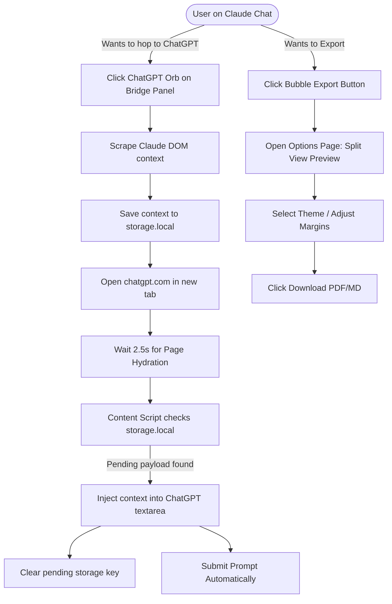

# Product Requirements Document (PRD): Omniscribe AI
**Product Version:** 1.0 (Consolidated Super-Extension)  
**Author:** Product Management & Technical Architecture Team  
**Date:** June 14, 2026  
**Status:** Ready for Engineering Review

---

## 1. Executive Summary
Omniscribe AI is a secure, privacy-first, local-first browser extension designed to optimize workflows for individuals who use multiple Large Language Model (LLM) interfaces daily. By consolidating the real-time context-transfer mechanics of the **LLM Context Bridge** with the advanced document formatting and workspace synchronization features of **AI Exporter**, Omniscribe AI serves as a unified control shell. It enables users to transfer prompt contexts between active LLM tabs in one click, format and download conversations into high-fidelity documents (PDF, Markdown, Word, PNG, JSON), and sync their knowledge vaults directly into Notion workspaces.

---

## 2. Problem Statement
Professional AI users suffer from fragmentation across web LLMs (ChatGPT, Claude, Gemini, Perplexity, Grok):
1.  **The "Tab-Hop" Tax:** Users must manually copy chat threads, write handoff prompts, open a new target LLM, wait for page load, and paste content to switch between models.
2.  **Siloed Knowledge:** Valuable conversation logs are trapped inside individual vendor platforms with poor search and backup tools.
3.  **Poor Document Formatting:** Standard copy-pasting or printing chats outputs unreadable raw text, missing formatting, broken LaTeX mathematical equations, and unstructured code blocks.

---

## 3. Product Vision
To build a seamless, secure, and beautiful interface layer that turns independent, fragmented LLM web tools into a single, unified, local-first personal knowledge ecosystem.

---

## 4. Goals (Success Metrics)
*   **Context Transfer Speed:** Handoff transit time between tabs must be under `1.5 seconds` (excluding network load time).
*   **Zero-Dependency Local Rendering:** All documents (PDF, Docx, PNG) must be generated 100% client-side in the browser.
*   **Selector Resilience:** Establish a modular selector configuration structure allowing rapid updates when target websites alter their CSS/DOM schemas.
*   **Privacy Mandate:** Zero remote backend storage, meaning all data is cached locally inside the user's browser (IndexedDB).

---

## 5. Non-Goals
*   We will **not** host or run LLMs on remote servers.
*   We will **not** sync user conversation data to a proprietary cloud database.
*   We will **not** intercept or store users' passwords or session cookies externally.

---

## 6. User Personas
### Persona A: Marcus (The AI Hopper)
*   *Role:* Full-Stack Software Developer.
*   *Behavior:* Switches constantly between Claude (code architecture) and ChatGPT (unit testing & refactoring).
*   *Needs:* Fast, key-bound context transfer and instant code block extraction.

### Persona B: Sarah (The Digital Curator)
*   *Role:* Research Scientist.
*   *Behavior:* Runs detailed prompt searches across Claude, Gemini, and Google Search AI Overviews.
*   *Needs:* High-fidelity PDF printouts (with fully rendered mathematical notation) and automated database sync to her laboratory Notion workspace.

---

## 7. User Stories & Acceptance Criteria

| ID | User Story | Acceptance Criteria |
| :--- | :--- | :--- |
| **US-1** | As a hopper, I want to click a floating icon to automatically carry my active chat context to a different LLM. | 1. Floating panel contains quick-links to ChatGPT, Claude, Gemini, Perplexity, and Grok.<br>2. Clicking an icon opens the target LLM in a new tab.<br>3. Automatically scrapes current visible conversation and injects it into the target input box on load. |
| **US-2** | As Marcus, if auto-injection fails on a target website, I want a fallback mechanism so my workflow doesn't break. | 1. If injection fails after 3 seconds, copy the compiled context block to the system clipboard.<br>2. Ingress a subtle, non-intrusive toast notification instructing the user to paste (`Ctrl+V`). |
| **US-3** | As Sarah, I want to edit how my exported conversations look before I save them. | 1. Open a split-pane preview screen.<br>2. Allow real-time changes to font size, padding margins, column width, and border styles.<br>3. Allow switching between at least 6 theme styles. |
| **US-4** | As Sarah, I want to push my structured conversations to Notion databases directly from my active tab. | 1. Integrates Notion authorization tokens locally.<br>2. Automatically maps chat message-response structures to Notion page blocks.<br>3. Rewrites CORS headers on the fly to bypass browser blocking. |

---

## 8. Core Features

### 8.1. Unified Content Injector (The Orb Panel)
*   **Description:** A draggable, glassmorphic panel overlay injected onto all supported LLM sites.
*   **Features:**
    *   One-click transition icons matching the target platforms.
    *   Drag-to-dock handle that remembers screen coordinates across refreshes.
    *   Collapsible button to hide/show the panel instantly.

### 8.2. Smart Scraper Engine
*   **Description:** A modular script running in the active tab context.
*   **Scrapes:** Prompts, system answers, code segments, LaTeX formulas, and thinking paths.
*   **Supported Targets:** 19+ platforms (ChatGPT, Claude, Gemini, DeepSeek, Perplexity, Grok, Google AI Overview, Poe, etc.).

### 8.3. Multi-Format Export & Styling Pipeline
*   **Description:** Local document compiler.
*   **Formations:**
    *   **PDF:** Using `jsPDF` for pages, margins, custom headers, and text wraps.
    *   **Markdown (.md):** Clean text files utilizing standard header hierarchies.
    *   **Word (.docx):** Structured lists and tables.
    *   **Image (.png):** Renders HTML canvas elements of active chats.
    *   **JSON:** Pure data dump for system backup.

### 8.4. Local SidePanel Aggregator
*   **Description:** SidePanel UI to assemble custom exports.
*   **Features:**
    *   Checkbox toggle on page message bubble toolbar.
    *   Allows multi-selecting turns from Claude and ChatGPT into a consolidated queue.
    *   Allows ordering the sequence of items before exporting.

---

## 9. Future Features (V2 Scope)
*   **Local Vector DB Search:** Offline semantic search over IndexedDB cache using locally run Web-Assembly embeddings models.
*   **Auto-PII Masking:** Local regex scanning to flag and redact emails, passwords, credit card numbers, and API tokens before saving or exporting.

---

## 10. User Flow (Mermaid Diagram)



---

## 11. UX Requirements
1.  **Aesthetics:** High-end glassmorphism styling (`backdrop-filter: blur(12px)`) for floating widgets. Use CSS variables to adapt dynamically to the parent website's light/dark mode settings.
2.  **Responsiveness:** Floating widgets must adjust their layout relative to browser size, shrinking to circular action buttons on thin viewports.
3.  **Keyboard Accelerators:** Bind `Alt+B` to toggle the orb panel overlay, and `Alt+1` through `Alt+5` to trigger context hops directly.

---

## 12. Technical Requirements

### 12.1. Foundation Stack
*   **Manifest Standard:** MV3 (Manifest Version 3).
*   **Framework:** React 18 (for Popup, Options, Preview, and Sidepanel pages).
*   **Build Utility:** Vite + Webpack.
*   **Libraries:** `dexie.js` (IndexedDB Wrapper), `jspdf` (PDF generation), `docx` (Word generation), `katex` (Latex formatting).

### 12.2. Folder Organization (Consolidated Blueprint)
```text
e:/Projects/Extension V2/
├── _locales/               # Internationalization translations (10 languages)
├── rules/
│   └── request_modifier_rule.json # DeclarativeNetRequest Notion header overrides
├── src/
│   ├── background/
│   │   └── service_worker.js # Coordination, Tab listeners, Notion Auth API Proxies
│   ├── content-scripts/
│   │   ├── content.js      # Consolidated scraping, injection, and UI Orb overlay
│   │   ├── start.js        # DOM injection prep, initialization
│   │   └── content.css     # Orb widgets and toolbar buttons styles
│   ├── popup/              # React Popup UI code
│   ├── options/            # React Settings code
│   ├── preview/            # React Document Previewer code
│   ├── sidepanel/          # React Chat Aggregator code
│   └── database/
│       └── local_db.js     # Dexie DB definitions (IndexedDB schemas)
└── manifest.json           # Unified permission definitions
```

---

## 13. Security Requirements
1.  **Content Security Policy (CSP):** Set standard strict CSP inside `manifest.json`. No external scripts or styles are allowed to execute inside extension contexts.
2.  **Isolated Sandbox:** Formula calculations and HTML preview rendering must execute inside the isolated `widget-sandbox.html` using `postMessage` interfaces.
3.  **Permissions Matrix:**
    *   `tabs`: To monitor LLM URL completions.
    *   `storage`: For configuration variables and temporary context transport.
    *   `cookies`: Required to validate local sessions for third-party sync.
    *   `declarativeNetRequest`: To dynamically inject origin headers targeting `notion.so`.
    *   `sidePanel`: Standard Chrome sidebar access.
    *   `contextMenus`: To register right-click "Export Chat" shortcuts.

---

## 14. Performance Requirements
*   **Main Thread Blocking:** Scrapers must use non-blocking asynchronous intervals (`requestIdleCallback`) to prevent layout delays or keyboard input lag on parent AI tabs.
*   **Database Search Speed:** Full-text search of historical local logs using Dexie queries must resolve in `< 100ms`.
*   **Memory Footprint:** The extension service worker must suspend itself automatically when inactive and consume `< 45MB` of RAM when executing background pipelines.

---

## 15. Browser Compatibility
Target environments (Chromium-based engines supporting Manifest V3 and SidePanel API):
*   Google Chrome (v116+)
*   Microsoft Edge (v116+)
*   Brave (v116+)
*   Arc Browser (v1.0+)

---

## 16. API Requirements
### 16.1. Notion Integration API
Uses Notion API `v1`. The extension must rewrite headers for incoming/outgoing sync calls:
*   **Origin Header Injection:** Rewritten to `https://www.notion.so` to avoid CORS validation failures.
*   **Payload formatting:** Scraped JSON data must be mapped to Notion Page block layouts:
```json
{
  "children": [
    {
      "object": "block",
      "type": "heading_2",
      "heading_2": { "rich_text": [{ "text": { "content": "User Prompt" } }] }
    },
    {
      "object": "block",
      "type": "paragraph",
      "paragraph": { "rich_text": [{ "text": { "content": "Sample prompt text..." } }] }
    }
  ]
}
```

---

## 17. Data Storage Requirements

### 17.1. Database Schema (IndexedDB via Dexie)
```javascript
const db = new Dexie('OmniscribeDB');
db.version(1).stores({
  conversations: 'id, title, platform, url, timestamp',
  messages: '++id, conversationId, role, content, thinkingContent, timestamp',
  options: 'key, value'
});
```

---

## 18. Error Handling
*   **Auto-Injection Selector Breakage:** If `content.js` fails to locate the text input area of a supported LLM during a Bridge action (indicating a site update):
    1.  Copy the pending prompt immediately into the system clipboard.
    2.  Display a local toast widget: *"Selector mismatch. We copied the context to your clipboard. Please paste (Ctrl+V) directly into the prompt box."*
    3.  Log the error telemetry locally inside the IndexedDB error log to allow manual updates.
*   **Notion Credentials Expiry:** If the Notion sync returns `401 Unauthorized`, pop a UI toast alerting the user to re-authenticate inside the Options Panel.

---

## 19. Monetization Strategy
*   **Standard Local Utilities (Free):** Unlimited tab-to-tab context bridging, local Markdown/Text downloads, standard local Indexing, and popup controls.
*   **Professional Toolkit (Pro - $5/month):** Customizable handoff preambles, unlimited PDF/Word exports with custom styling themes (Lavender, Old Paper, Sakura), and direct Notion integration.

---

## 20. Release Plan
1.  **Phase 1 (Alpha Integration):** Merge background handlers and compile target scrapers into a unified Vite template.
2.  **Phase 2 (Beta Testing):** Distribute packaged `.zip` to test group. Validate injection across all 5 primary platforms.
3.  **Phase 3 (Chrome Web Store Launch):** Deploy publicly under unified branding.

---

## 21. Risks & Mitigation
*   **Risk:** Target LLMs update their DOM tags weekly, breaking scraping rules.
*   **Mitigation:** The scraper engine will read selectors from a localized JSON mapping configuration cache. The extension will check for updated selector maps silently in the background, updating rules without requiring a full Chrome Web Store extension revision.

---

## 22. Implementation Milestones

```text
Milestone 1: Core Consolidation [Weeks 1-2]
├── Establish Vite React boilerplate
├── Merge Chrome declarativeNetRequest rules
└── Refactor scraping selectors into a unified config

Milestone 2: Bridge UI & Execution [Weeks 3-4]
├── Implement glassmorphic Orb overlay panel
├── Integrate background tab navigation orchestration
└── Hook Quill/ProseMirror input auto-injection methods

Milestone 3: Preview Panel & Exporters [Weeks 5-6]
├── Implement Dexie database layer for local history
├── Build React option preview page with themes
└── Refactor jsPDF and docx-generation local engines

Milestone 4: Notion & Release Prep [Week 7]
├── Verify Notion CORS API rewrites
└── Implement local-license tier limits
```
