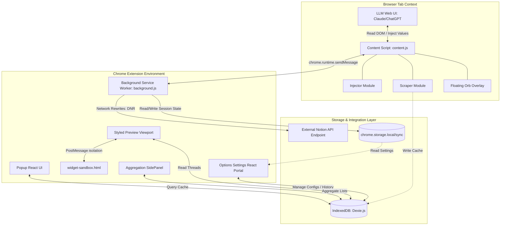
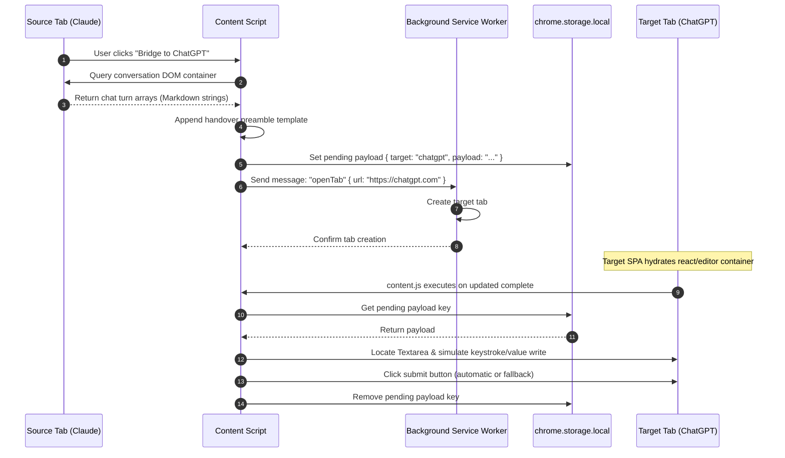
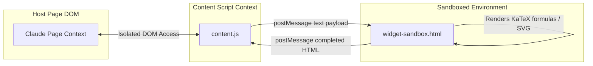
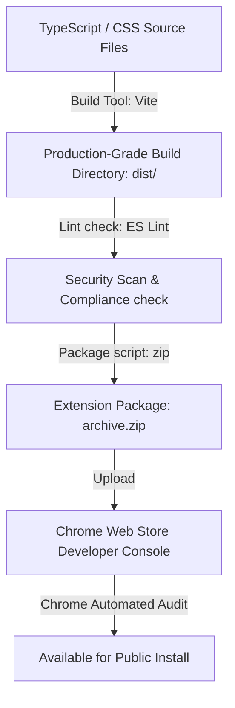

# Technical Architecture: Omniscribe AI
**Product Version:** 1.0 (Consolidated Super-Extension)  
**Author:** Technical Architect Team  
**Date:** June 14, 2026  
**Status:** Architecture Design Complete

---

## 1. System Overview & Architecture Diagrams

Omniscribe AI utilizes a local-first architecture. All heavy computation—such as document styling, PDF formatting, syntax parsing, and database transactions—runs client-side inside the user's browser runtime. 

### 1.1. Overall Component Architecture
The diagram below illustrates the relationship between Content Scripts (active LLM tabs), the Service Worker, sandboxed frames, storage structures, and external API services.



### 1.2. Tab Handoff Context Flow (Context Bridge)
This diagram maps the step-by-step event sequence during a context handoff action between two active LLM tabs.



---

## 2. Directory Structure

The repository follows a clean React + Vite workspace config, compiling background service workers, content scripts, and page endpoints separate from one another:

```text
omniscribe-extension/
├── package.json
├── tsconfig.json
├── vite.config.ts              # Configuration for background, popup, options build steps
├── manifest.json               # Manifest V3 configuration
├── _locales/                   # Multi-language translation packs
│   ├── en/messages.json
│   ├── es/messages.json
│   └── ja/messages.json
├── public/                     # Static assets
│   ├── assets/
│   │   ├── icon-16.png
│   │   ├── icon-48.png
│   │   └── icon-128.png
│   ├── rules/
│   │   └── request_modifier_rule.json # Notion CORS DNR rules
│   └── widget-sandbox.html     # HTML Sandboxing environment for KaTeX formulas
└── src/
    ├── background/
    │   └── background.ts       # Orchestration, Tab lifecycle listeners, and Notion auth APIs
    ├── content-scripts/
    │   ├── content.ts          # Orchestrator for scrapers, injectors, and UI widgets
    │   ├── scraper.ts          # Selector routines for 19+ platforms
    │   ├── injector.ts         # Editor simulations (Quill, ProseMirror, standard textareas)
    │   └── content.css         # Styling for the floating glassy orb dock
    ├── database/
    │   └── local_db.ts         # Dexie database mapping and initialization logic
    ├── popup/                  # React Popup UI source
    │   ├── Popup.tsx
    │   └── main.tsx
    ├── options/                # Settings & Local history management console
    │   ├── Options.tsx
    │   └── main.tsx
    ├── preview/                # Split-pane styled printing layout page
    │   ├── Preview.tsx
    │   ├── preview.css
    │   └── themes.ts           # Styles sheets configuration arrays (Lavender, Sakura, etc.)
    ├── sidepanel/              # Aggregate history composer pane
    │   ├── SidePanel.tsx
    │   └── main.tsx
    ├── shared/                 # Common type files, utilities, and i18n configurations
    │   ├── types.ts
    │   ├── i18n.ts
    │   └── constants.ts
    └── sandbox/                # Sandbox scripting utility for math parsing
        └── sandbox_processor.ts
```

---

## 3. Database Schema Design (IndexedDB)

The extension stores large dataset records locally via **IndexedDB** using **Dexie.js**. This ensures rapid querying, indexing, and prevents local cache storage quota blockages.

```typescript
import Dexie, { Table } from 'dexie';

export interface Conversation {
  id: string;          // Scraped hash id or auto-generated uuid
  title: string;       // Thread topic
  platform: string;    // chatgpt | claude | gemini | deepseek
  url: string;         // Link to original chat log
  timestamp: number;   // Unix epoch millisecond timestamp
  tags?: string[];     // Local categorized folder tags
}

export interface Message {
  id?: number;         // Primary key, auto-incrementing
  conversationId: string; // Foreign key referencing Conversation.id
  role: 'user' | 'assistant' | 'system';
  content: string;     // Text markdown content
  thinkingContent?: string; // DeepSeek/Gemini internal logs
  timestamp: number;
}

export class OmniscribeDatabase extends Dexie {
  conversations!: Table<Conversation>;
  messages!: Table<Message>;

  constructor() {
    super('OmniscribeDB');
    this.version(1).stores({
      conversations: 'id, title, platform, timestamp, *tags',
      messages: '++id, conversationId, role, timestamp'
    });
  }
}

export const db = new OmniscribeDatabase();
```

---

## 4. Frontend Architecture & State Management

Omniscribe AI's frontends (Popup, Options, Preview, and Sidepanel) are written as modular React components.

### 4.1. Core Frontend Viewports
1.  **Options Panel:** History index browser, theme customize dashboards, backup/restore tool.
2.  **Document Preview Page:** Dynamic split-view container. One side holds styling options (padding size, borders, font adjustments), the other side displays a sandboxed iframe to render layouts and output targets (PDF/Word).
3.  **Side Panel Widget:** Aggregation manager list. Enables bulk additions and sequence updates before running exports.

### 4.2. Local State Management Strategy
Because there is no remote server, state is maintained locally. Dexie provides live hooks to keep React components reactively linked to IndexedDB storage:

*   **Dexie React Hooks:** `useLiveQuery` is utilized to monitor DB tables. When content scripts save a new scraped message, the options view and sidebar lists update immediately without requiring manual event dispatches.
*   **Settings/Preferences:** Managed via React Context wrappers referencing `chrome.storage.local` and `chrome.storage.sync` APIs.

---

## 5. Backend Architecture (Service Worker Core)

In browser extensions, the "backend" is represented by the background **Service Worker** (`background.ts`).

### 5.1. Operations & Tab Lifecycle Orchestration
1.  **Tab Creation & Handoff:**
    *   Listens to `openTab` requests from active tabs.
    *   Creates target windows.
    *   Monitors `chrome.tabs.onUpdated`. When the target state is `complete`, it waits `2.5 seconds` (hydration margin) before messaging the tab's content script to inject the prompt.
2.  **Notion Sync Proxy:**
    *   Since direct content script fetch calls face CORS restrictions when pinging `notion.so`, the Service Worker handles API dispatching.
    *   Header interception rules (`declarativeNetRequest`) modify headers on these requests before they hit Notion API routes.

---

## 6. Authentication Flow

Omniscribe AI operates under a zero-cloud credential policy.

### 6.1. Notion OAuth Integration Flow

```mermaid
sequenceDiagram
    autonumber
    participant User as User
    participant Opt as Options Page (React)
    participant SW as Service Worker (background.ts)
    participant Notion as Notion Auth Endpoint

    User->>Opt: Click "Link Notion Workspace"
    Opt->>SW: Dispatch message: "startNotionAuth"
    SW->>SW: Call chrome.identity.launchWebAuthFlow()
    SW->>Notion: Send authorize call with redirect URI
    Notion-->>SW: Redirect with Authorization Code
    SW->>Notion: POST Authorization Code to exchange for Access Token
    Notion-->>SW: Return Access Token
    SW->>SW: Encrypt and store Token in chrome.storage.local
    SW-->>Opt: Send message "authSuccess"
    Opt->>User: Display "Notion Workspace Linked Successfully"
```

---

## 7. API Design (Message Passing Interface)

Communications between components rely on Chrome’s message brokers. The schema below specifies the JSON payload interfaces.

### 7.1. Message Registry Interface
```typescript
type SystemMessage = 
  | { type: 'BRIDGE_START'; target: string; prompt: string }
  | { type: 'OPEN_PREVIEW'; conversationId: string }
  | { type: 'SYNC_TO_NOTION'; conversationId: string }
  | { type: 'NOTION_AUTH_START' }
  | { type: 'TOAST_MESSAGE'; text: string; severity: 'success' | 'warning' | 'error' };
```

---

## 8. Security & Sandbox Model

Chromium’s MV3 guidelines enforce strict restrictions on remote script execution. Omniscribe AI mitigates security risks through isolated contexts.



### 8.1. Declarative Net Request (DNR) Policy
The `rules/request_modifier_rule.json` overrides CORS constraints. Rules intercept traffic targeting Notion's api addresses and rewrite headers:
```json
[
  {
    "id": 101,
    "priority": 1,
    "action": {
      "type": "modifyHeaders",
      "requestHeaders": [
        { "header": "origin", "operation": "set", "value": "https://www.notion.so" }
      ]
    },
    "condition": {
      "urlFilter": "https://www.notion.so/*",
      "resourceTypes": ["xmlhttprequest"],
      "domainType": "thirdParty",
      "initiatorDomains": ["kagjkiiecagemklhmhkabbalfpbianbe"]
    }
  }
]
```

---

## 9. Deployment Architecture & Build Pipeline

The development build pipeline utilizes Vite to package assets ready for Chrome Web Store distribution:


*   **Build Optimization:** Code chunks must be minified, splitting React node modules from popup/options pages to keep individual content scripts lightweight.
*   **Automated Validation:** Build runs test sets to check DOM scraper rules against mock pages before packaging.
